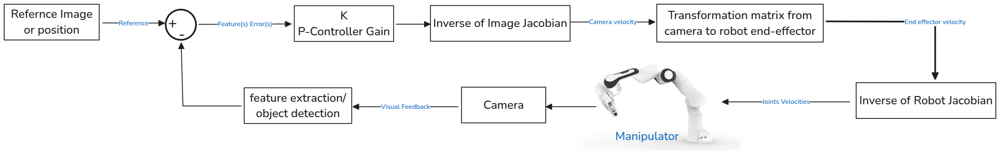
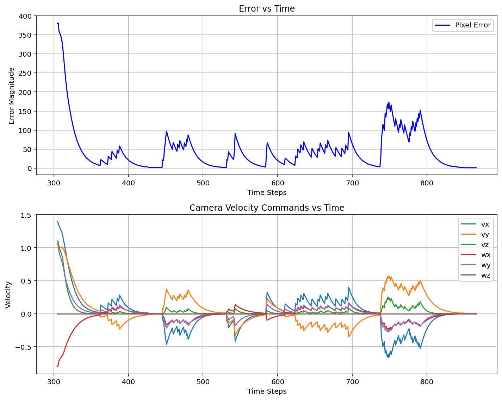

# Franka Panda Robot Object Tracking using IBVS

## Overview

This project implements a **Visual Servoing** system for a Franka Panda robot in a PyBullet simulation environment. The robot tracks and moves toward a red ball using the **Image-Based Visual Servoing (IBVS)** control method. The system detects the ball in the camera feed, estimates its position in 3D space, and uses the visual error (displacement in image space) to control the robot's motion and align it with the object.

### What is IBVS (Image-Based Visual Servoing)?

**IBVS** is a control strategy used in robotics where the robot’s movements are directly controlled based on the error between the current image (from a camera) and a target image or position. The primary idea is to minimize the difference between the target object's image or position and its actual position in the camera view. This approach allows the robot to perform tasks like object tracking grasping, and different manipulation tasks solely using visual information from the camera.

The control diagram is illustrated below:
<div align="center">

<p>Image-Based Visual Servoing Control Diagram</p>
</div>

## Work Done

- **Franka Panda in PyBullet**: simulating the Franka Panda robotic arm in a 3D environment using PyBullet, which includes setting up the robot and integrating a camera with the robot end-effector.
  
- **Object Tracking**: A red ball is placed in the environment. The robot uses its camera (mounted on the end-effector) to track the ball and move toward it by adjusting its joints.
  
- **IBVS Control**: The control method used to move the robot toward the target is Image-Based Visual Servoing. The robot computes the 2D error (displacement in pixel coordinates) in the camera view and translates this into a 6D velocity for the robot's end-effector to follow the object.
  
- **Data Logging**: The simulation tracks and logs various data points such as error and velocities, which are saved to a CSV file for analysis.


## Results
https://github.com/user-attachments/assets/1e443d56-d7a0-478c-a68b-60ab46f2091c

<div align="center">

</div>

## Modularity

This code is designed with modularity in mind. Several components of the simulation are separated into distinct functions and can be easily modified or extended:

1. **Ball Detection**: 
   - The `detect_red_ball()` function handles the detection of the red ball from the camera feed using color filtering and contour analysis. It can be replaced with any other object detection method (such as using deep learning-based object detectors) to detect specific or different objects in the scene.

2. **Camera Pose Calculation**: 
   - The `panda_camera()` function computes the camera view from the robot's end-effector. It can be changed to simulate different camera setups or use a different projection method.
   
3. **IBVS Control**: 
   - The `ibvs_control()` function implements the visual servoing control law. The parameters (such as the proportional gain `Kp`) and the Jacobian matrix can be adjusted for different tracking performance or to adapt the robot's behavior in more complex scenarios.
   
4. **Jacobian Calculation**: 
   - The `get_image_jacobian()` function calculates the image Jacobian based on the pixel error. It can be modified to use a different Jacobian formulation or to account for different camera models.
   
5. **Joint Control**: 
   - The `update_joints()` function applies the joint control commands to the Franka Panda robot. The control mode is set to `POSITION_CONTROL`, but this can be changed to `VELOCITY_CONTROL` or `TORQUE_CONTROL` for different types of control strategies.
   
6. **Logging**: 
   - The `simulation_data.csv` file logs the error history and velocities during the simulation. This can be changed to log different data or output it in a different format.

## How to Use

1. **Clone the repository**:
   ```bash
      git clone https://github.com/mohamedmajdi/IBVS-Panda-Manipulator.git
      cd IBVS-Panda-Manipulator
    ```
2. **Create a conda environment & Install the dependencies**:
  ```bash
    conda create --name <env_name> --file requirements.txt
   ```
3. **Running the simulation**
     -  Run `IBVS_panda_arm.py` and interact with the GUI sliders to move the object in the simulation

4. **Analyzing the Control Performance**
      - Run `results_plottings.py` to plot and analyze the control performance data that will be stored during simulation in the `simulation_data.csv` log file
